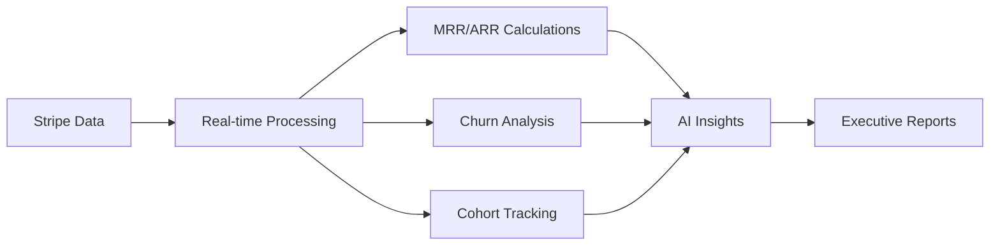

# 🚀 SaaS Report

> **Enterprise-grade SaaS analytics and reporting platform powered by AI**

[](https://saasreport.com)
[](https://docs.saasreport.com)
[](https://discord.gg/saasreport)
[](https://status.saasreport.com)

Transform your Stripe data into investor-ready reports with GPT-4o powered narratives. Built on Cloudflare's edge infrastructure for global performance and enterprise security.

---

## 🏢 About SaaS Report

SaaS Report is a comprehensive analytics platform designed specifically for SaaS businesses. We help companies turn their billing data into actionable insights through:

- **📈 Real-time Analytics**: MRR, ARR, churn, and cohort analysis
- **🤖 AI-Powered Insights**: GPT-4o generated executive summaries
- **📋 Professional Reports**: Investor-ready PDF reports with secure distribution
- **🔐 Enterprise Security**: SOC 2 compliant with end-to-end encryption
- **⚡ Global Performance**: Sub-100ms response times worldwide

## 📦 Repositories

### Core Platform
- **[`app`](https://github.com/SaasReport/app)** - Main application monorepo
  - Cloudflare Workers API backend
  - Stripe App frontend integration
  - Multi-tenant D1 database
  - Analytics engine with AI narratives

### Libraries & Tools
- **[`sdk`](https://github.com/SaasReport/sdk)** - TypeScript/JavaScript SDK for developers
- **[`docs`](https://github.com/SaasReport/docs)** - Documentation and API references
- **[`examples`](https://github.com/SaasReport/examples)** - Integration examples and templates

### Infrastructure
- **[`terraform`](https://github.com/SaasReport/terraform)** - Infrastructure as Code for deployments
- **[`helm-charts`](https://github.com/SaasReport/helm-charts)** - Kubernetes deployment charts

## 🛠️ Tech Stack

| Component | Technology | Purpose |
|-----------|------------|---------|
| **Backend** | Cloudflare Workers | Serverless API endpoints |
| **Database** | Cloudflare D1 | Multi-tenant SQLite |
| **Storage** | Cloudflare R2 | Report files and assets |
| **Frontend** | React + TypeScript | Stripe App integration |
| **AI** | OpenAI GPT-4o | Executive narrative generation |
| **Email** | AWS SES | Report delivery |
| **Monitoring** | Cloudflare Analytics | Performance and uptime |

## 🌟 Key Features

### 📊 **Advanced Analytics**


### 🔒 **Enterprise Security**
- **Multi-tenant Architecture**: Complete isolation between customers
- **Encryption**: AES-256-GCM for data at rest, TLS 1.3 in transit
- **Access Control**: RBAC with usage-based limitations
- **Compliance**: SOC 2, GDPR, CCPA ready

### 🌍 **Global Infrastructure**
- **Edge Computing**: Cloudflare Workers in 300+ cities
- **Auto-scaling**: Handles traffic spikes automatically
- **99.99% Uptime**: Built for enterprise reliability
- **Global CDN**: Assets served from nearest edge location

## 📈 Pricing Plans

| Plan | Price | Reports/Month | AI Model | Use Case |
|------|-------|---------------|----------|----------|
| **Starter** | $599/mo | 25 | GPT-4o-mini | Growing startups |
| **Team** | $1,999/mo | 150 | GPT-4o | Scale-ups |
| **Enterprise** | $5,999/mo | 600 | GPT-4o | Large enterprises |

*All plans include secure report distribution, email delivery, and 24/7 support*

## 🚀 Quick Start

### For Stripe App Users
1. Install the SaaS Report app from Stripe's App Marketplace
2. Authorize read-only access to your Stripe data
3. Generate your first report in under 60 seconds

### For API Users
```bash
# Install the SDK
npm install @saasreport/sdk

# Initialize client
import { SaasReport } from '@saasreport/sdk';
const client = new SaasReport({ apiKey: 'your-api-key' });

# Generate a report
const report = await client.reports.generate({
  period: { start: '2024-01-01', end: '2024-01-31' },
  type: 'monthly_kpis'
});
```

### Self-Hosted Deployment
```bash
# Clone the main repository
git clone https://github.com/SaasReport/app.git
cd app

# Install dependencies
pnpm install

# Configure environment
cp .env.example .env
# Edit .env with your credentials

# Deploy to Cloudflare
pnpm deploy
```

## 🤝 Contributing

We welcome contributions from the community! Here's how you can help:

### 🐛 **Bug Reports**
- Check existing [issues](https://github.com/SaasReport/app/issues)
- Create detailed bug reports with reproduction steps
- Include environment details and error logs

### 💡 **Feature Requests**
- Browse our [roadmap](https://github.com/orgs/SaasReport/projects/1)
- Submit enhancement proposals via [discussions](https://github.com/orgs/SaasReport/discussions)
- Vote on features you'd like to see

### 🔧 **Code Contributions**
1. Fork the relevant repository
2. Create a feature branch (`git checkout -b feature/amazing-feature`)
3. Make your changes with tests
4. Submit a pull request

### 📚 **Documentation**
- Improve API documentation
- Add integration examples
- Fix typos and clarify instructions

## 🎯 Roadmap

### Q1 2025
- [ ] **QuickBooks Integration** - Connect accounting data for complete financial picture
- [ ] **Shopify Integration** - E-commerce analytics and revenue reconciliation
- [ ] **Advanced Cohort Analysis** - Customer lifetime value predictions
- [ ] **Custom Branding** - White-label reports with company branding

### Q2 2025
- [ ] **Real-time Dashboards** - Live KPI monitoring and alerts
- [ ] **API Rate Limiting** - Enhanced usage controls and monitoring
- [ ] **Multi-language Support** - Reports in 10+ languages
- [ ] **Mobile App** - iOS/Android apps for on-the-go reporting

### Q3 2025
- [ ] **Predictive Analytics** - ML-powered forecasting and recommendations
- [ ] **Slack/Teams Integration** - Report delivery to team channels
- [ ] **Data Warehouse Connectors** - BigQuery, Snowflake integrations
- [ ] **Compliance Dashboard** - SOC 2, GDPR compliance monitoring

## 📞 Support & Community

### 🆘 **Getting Help**
- **Documentation**: [docs.saasreport.com](https://docs.saasreport.com)
- **Community Support**: [Discord Server](https://discord.gg/saasreport)
- **Email Support**: support@saasreport.com
- **Enterprise Support**: enterprise@saasreport.com

### 💬 **Community**
- **Discord**: [Join our community](https://discord.gg/saasreport) for real-time chat
- **GitHub Discussions**: [Ask questions and share ideas](https://github.com/orgs/SaasReport/discussions)
- **Twitter**: [@SaasReport](https://twitter.com/saasreport) for updates and announcements
- **LinkedIn**: [Company Page](https://linkedin.com/company/saasreport) for business updates

### 📧 **Newsletter**
Stay updated with monthly product updates, industry insights, and SaaS metrics best practices.

[**Subscribe to our newsletter →**](https://saasreport.com/newsletter)

## 🏆 Recognition

- **Y Combinator S23**: Featured in the accelerator program
- **Stripe Partner**: Official Stripe App Marketplace partner
- **SOC 2 Type II**: Independently audited for security compliance
- **99.99% Uptime**: Proven enterprise reliability track record

## 📊 By the Numbers

- **1,000+** SaaS companies trust SaaS Report
- **$2B+** in ARR tracked and analyzed
- **10M+** data points processed monthly
- **50ms** average API response time globally
- **99.99%** uptime over the last 12 months

## 🔗 Useful Links

| Resource | Description | Link |
|----------|-------------|------|
| **Website** | Main product website | [saasreport.com](https://saasreport.com) |
| **Documentation** | Complete API docs and guides | [docs.saasreport.com](https://docs.saasreport.com) |
| **Status Page** | Real-time system status | [status.saasreport.com](https://status.saasreport.com) |
| **Blog** | SaaS metrics insights and updates | [blog.saasreport.com](https://blog.saasreport.com) |
| **Changelog** | Product updates and releases | [changelog.saasreport.com](https://changelog.saasreport.com) |
| **Security** | Security practices and compliance | [security.saasreport.com](https://security.saasreport.com) |

---

<div align="center">

**Built with ❤️ for the SaaS community**

[Website](https://saasreport.com) •
[Documentation](https://docs.saasreport.com) •
[Discord](https://discord.gg/saasreport) •
[Twitter](https://twitter.com/saasreport) •
[LinkedIn](https://linkedin.com/company/saasreport)

**© 2025 SaaS Report. All rights reserved.**

</div>